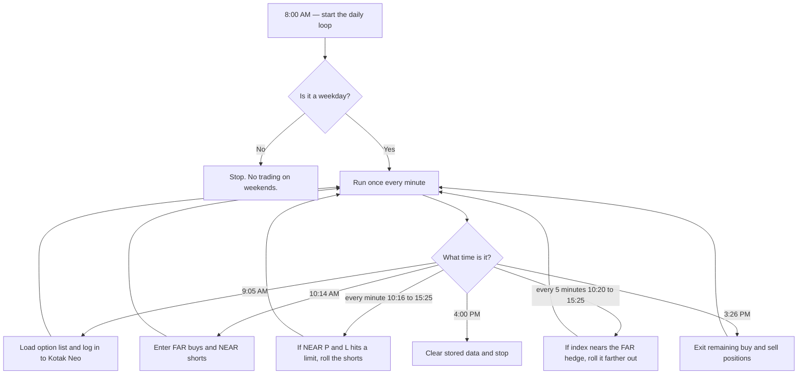

# napi

This project is **outdated and no longer maintained**.

It is kept here for historical reference only. Do not run it against a live brokerage account.

## What this was

A Google Apps Script, attached to a Google Sheet, that traded index options through [Kotak Neo](https://www.kotaksecurities.com/) (`napi.kotaksecurities.com`).

It used [Dhan](https://dhan.co) only for live prices, and sent alerts to Telegram.

The idea was a two-sided options book:

- **NEAR sell:** short Call and Put a few strikes away from the index, and roll them if profit or loss hit a set percent.
- **FAR buy:** buy cheap, far out-of-the-money Call and Put as a hedge, and roll them if the index moved too close.

A sidebar in the Sheet also let you place those trades by hand.

## How a trading day worked

Most weekdays it traded **NIFTY**. Thursday it switched to **SENSEX**. Weekends were skipped.

1. **8:00 AM** — A daily trigger starts a loop that runs once every minute.
2. **9:05 AM** — Download Kotak's option list into the `SCRIP` sheet, then log in to Kotak Neo (OAuth, password, OTP from Gmail).
3. **10:14 AM** — Open the FAR hedge buys and the NEAR short Call/Put pairs.
4. **10:16 AM – 3:25 PM** — Every minute, check the short book. If open P&L hits the profit or stop-loss percent, exit and enter a new NEAR pair.
5. **10:20 AM – 3:25 PM** — Every five minutes, check the FAR hedge. If the index has moved too close, buy a farther pair and exit the old one.
6. **3:26 PM** — Close remaining buy and sell positions.
7. **4:00 PM** — Clear stored data and stop until the next weekday.

Login was a six-step Kotak Neo session: OAuth token, PAN/password login, decode user id, request OTP, read the OTP from Gmail, then validate OTP. After that, orders went to Kotak. Prices came from Dhan. Alerts went to Telegram.

API keys, PAN, password, Dhan tokens, and Telegram credentials lived in an `ACCESS` sheet in Google Sheets, not in this repo. The OAuth Basic header in git is a placeholder only.

## Google Sheet tabs

| Sheet | Used for |
| --- | --- |
| `ACCESS` | Kotak, Dhan, and Telegram credentials |
| `SCRIP` | Today's option contracts from Kotak |
| `MASTER` | Open positions, lot size, P&L limits |
| `LOG` | Timestamped messages from each step |

The spreadsheet menu **Trading Terminal** opened three sidebars: Buying, Selling, and Setup (start/stop auth and the daily trigger).

## Files

| File | Role |
| --- | --- |
| `master.gs` | Read credentials from the Sheet, menu, Telegram, logging |
| `scheduler.gs` | Daily clock and which function runs when |
| `oAuthSession.gs` | Kotak Neo login, including OTP from Gmail |
| `importScrip.gs` | Load Kotak NSE/BSE option lists |
| `fetchSecIdSymbl.gs` | Look up contract id and trade symbol |
| `getLTP.gs` | Live prices from Dhan |
| `placeNeoOrder.gs` | Place an order on Kotak Neo |
| `getFundData.gs` | Account limits from Kotak |
| `decayLogic.gs` | Enter, exit, and rebalance NEAR sells and FAR buys |
| `intradayLogic.gs` | Manual Call/Put buys and square-off |
| `buyingSidebar.html` | Buying sidebar |
| `sellingSidebar.html` | Selling sidebar |
| `setup.html` | Auth and trigger sidebar |
| `repo.gs` | Old price-fetch experiments. Not used by the live flow. |
